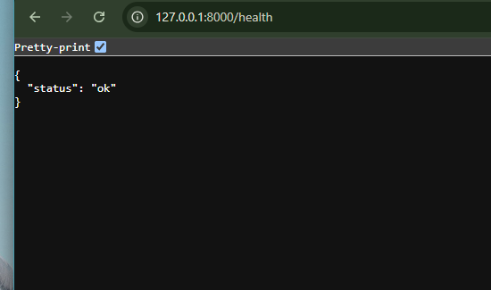
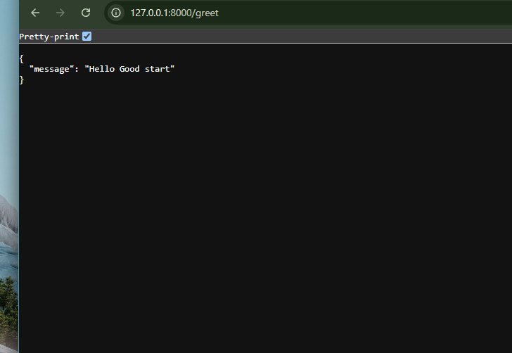

# fastapi-endpoint

## What it does
Exposes two JSON endpoints:

- `GET /health` — returns `{"status": "ok"}`
- `GET /greet` — returns a greeting message

## Running locally
Follow these steps to run on your PC

```
python3 -m venv venv
source venv/bin/activate
pip install -r requirements.txt
uvicorn main:app --reload
```

Server runs at `http://127.0.0.1:8000`.

## Testing

Browser:
- http://127.0.0.1:8000/health
- http://127.0.0.1:8000/greet




curl:
- `curl http://127.0.0.1:8000/health`
- `curl http://127.0.0.1:8000/greet`

## Containerized with Postgres

The app now runs alongside Postgres via Docker Compose. The `/health` and `/greet` endpoints are untouched from Week 1. A new `notes` resource (`GET /notes`, `POST /notes`) was added behind a `NoteRepository` interface with two implementations:

- `InMemoryNoteRepository` — used during initial development
- `PostgresNoteRepository` — swapped in by changing one line in `main.py` (`_repository = PostgresNoteRepository()`); no route code changed

## Running with Docker

Run `docker compose up --build`. This starts the app on `http://127.0.0.1:8000` and Postgres on port `5433` (mapped to avoid colliding with a local Postgres install). Connection details are in `.env` (git-ignored; see `.env.example` for the shape).

## Proving persistence

1. Ran `docker compose up --build`
2. `curl -X POST http://127.0.0.1:8000/notes -H "Content-Type: application/json" -d '{"title":"persisted","content":"from postgres"}'`
3. `curl http://127.0.0.1:8000/notes` — confirms the note exists
4. Stopped the stack (`Ctrl+C`), ran `docker compose up` again (no rebuild)
5. `curl http://127.0.0.1:8000/notes` — same note still returned, confirming the named volume (`pg_data`) preserved the data across a full container restart
